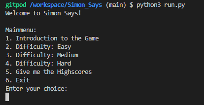
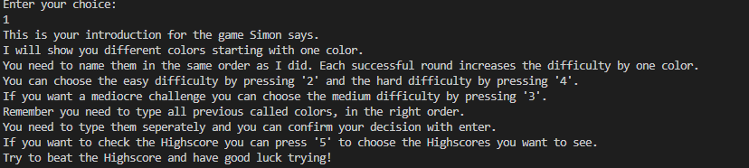
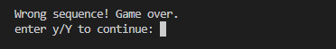

# Simon says

This is a fully deployed game of "Simon says", play against your Friends and everyone who got the url: "https://simonsays-86786c34e700.herokuapp.com/".
The goal is to name the colors in the right order exactly as Simon says. With each round it will be one color more to name.
An example would be:
<ol> 
    <li>Round: red 
    </li>
    <li>Round: red, yellow 
    </li>
    <li>Round: red, yellow, yellow 
    </li>
    <li>Round: red, yellow, yellow, blue 
    </li>
    <li>Round: red, yellow, yellow, blue, green.
    </li>
</ol>
This continues indefinitely until a wrong order of colors were named. Your maximum of Rounds will be sent to the Highscore sheet.
With three different difficulties and every difficulty has its own rankings.

## Table of content
<ol>
    <li>
    Features</li>
        <ol>
            <li>
            Menu</li>
            <li>
            Introduction</li>
            <li>
            Colorama</li>
            <li>
            Three different difficulties</li>
            <li>
            Highscores</li>
            <li>
            Tracking the rankings</li>
            <li>
            Replay immediately</li>
        </ol>
    <li>
    Testing</li>
        <ol>
        <li>
        Problems and Bugs encountered</li>
        <li>
        Validation</li>
        </ol>
    <li>
    Deployment</li>
    <li>
    Credits</li>
</ol>

## Features

The game offers various features which will be available on the deployed version of the game, those are listed below.

### Menu
The game allows to navigate through a quick and simple Menu

### Introduction
The Game offers an quick Introduction on what to do and what the goal of the game is.

### Colorama
The game offers colorized Fonts for the colors which need to be named in order to continue with the run. This is possible via the Colorama library.

### Three different difficulties
The game allows the user to play on three different difficulties. Each shortens the time the user have to memorize the new color in your sequence. 
The user can play on "easy" difficulty. Which gives 1 second of time. 
The user can play on "medium" difficulty. Which gives 1 second of time. But not the text itself is not colored, the background is colored. 
The user can play on "hard difficulty. Which gives 0.5 seconds of time. The color does not match the text.

### Highscores
The game will track how many rounds the user beat succesfully and rank them accordingly. Every difficulty has its own rankings.

### Track your ranking.
The user can always check the Highscores in the Terminal.

### Replay immediately
In case of a lose, the user can start a new Round immediately without the program exiting.
 

## Testing

I tested the program throughout various phases of its development.

In order to keep this clean and because some of the features are implemented with a very short timelimit, I decided to record one full testing of every function of the program in a Video. The url will be provided here"https://www.youtube.com/watch?v=yPjRFFwugZY".

### Problems and Bugs encountered

The Major problem I encountered during the development was to ensure the colors are randomized during the complete sequence.
This was solved through the "random.choice" command and the "sequence.append" command.
In order to show the right color in the terminal the "f" statement in my print statement ensured exactly that. I got helped for that through "https://stackoverflow.com/" 

Another Problem encountered was the right use of the Colorama library. Which got recommended by my Mentor for this project.
Especially the different options for the different difficulties. Which I managed to create with the help of a Friend of mine who works as a Software developer.

The Function to clear the screen I used the AI Chatgpt, because I spent a lot of time trying and searching, without getting the result I liked. 

### Validation

The Code was tested for Validation and Readability with "https://pep8ci.herokuapp.com/" 
No Major issues were detected.

## Deployment

The site was deployed using Code Institute's mock terminal for Heroku. The steps to deploy are as follows:
<ul>
    <li>
    Make sure every "input" method has a new line.</li>
    <li>
    Update the requirements.txt</li>
    <li>
    Log in or Create a Heroku Account</li>
    <li>
    Fork or clone this repository</li>
    <li>
    Create a new Heroku app</li>
    <li>
    Set the buildbacks to Python and NodeJS in that order</li>
    <li>
    Link the Heroku app to the repository</li>
    <li>
    Click on Deploy</li>
</ul>

## Credits
I just used the following Programs and Websites for this Project:

<ul>
<li>
Heroku for deployment"https://dashboard.heroku.com/"</li>
<li>
Gitpod as my IDE"https://gitpod.io/"</li>
<li>
PEP8 for Validation</li>
<li>
Stackflow for tutorials"https://stackoverflow.com/"</li>
<li>
Colorama library for colorizing text.</li>
<li>
Guide for Colorama "https://pypi.org/project/colorama/"</li>
<li>
OBS for recording "https://obsproject.com/"</li>
<li>
Wondershare Filmora for rendering "https://filmora.wondershare.net/"</li>
<li>
Youtube for uploading "https://www.youtube.com/" </li>
<li>
Google Docs for the Highscores. "https://www.google.com/docs/"</li>
<li>
Chatgpt for the clear.screen function "https://chatgpt.com/auth/login"</li>

My Mentor who advised me to use the Colorama library and helped me make this project work.
A Friend of mine who helped me with the Colorama and determine the different colors to different difficulties of the game.

